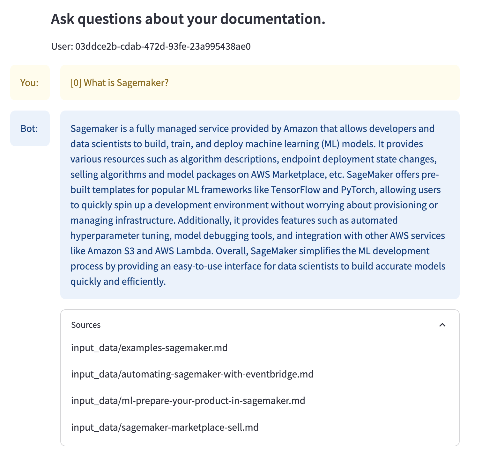
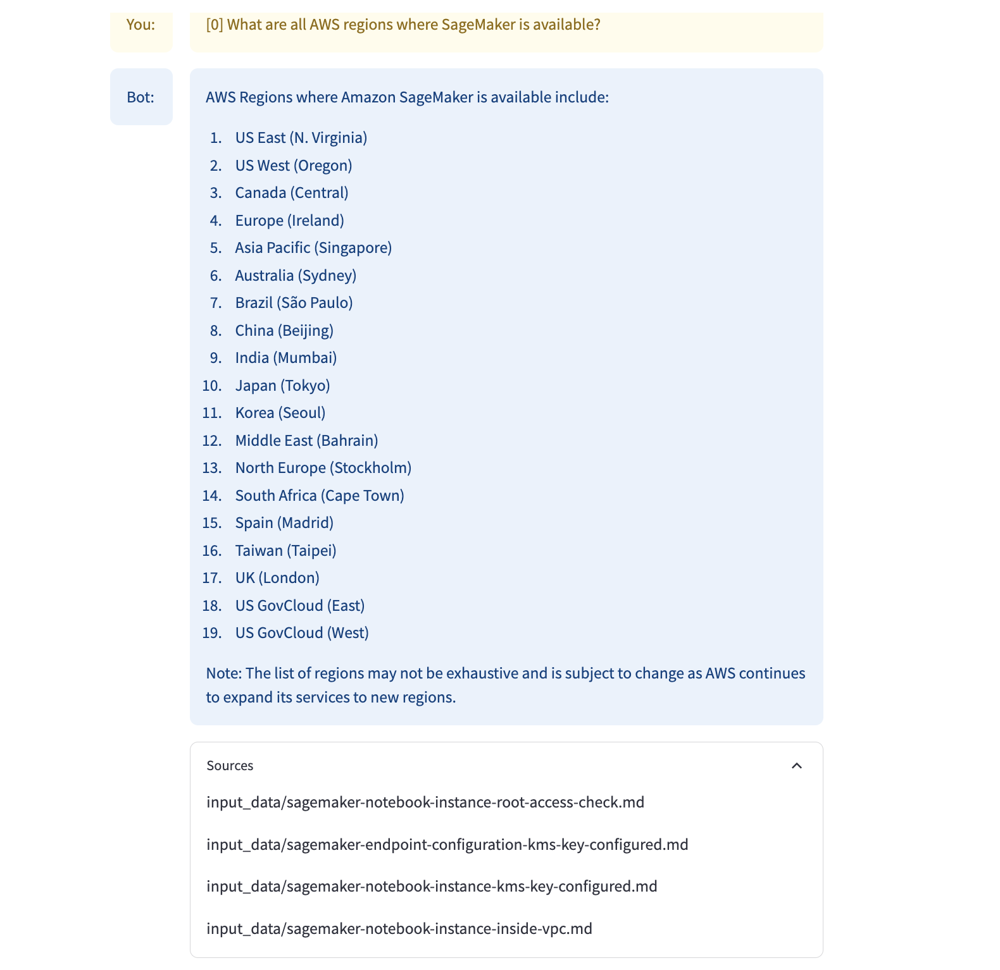
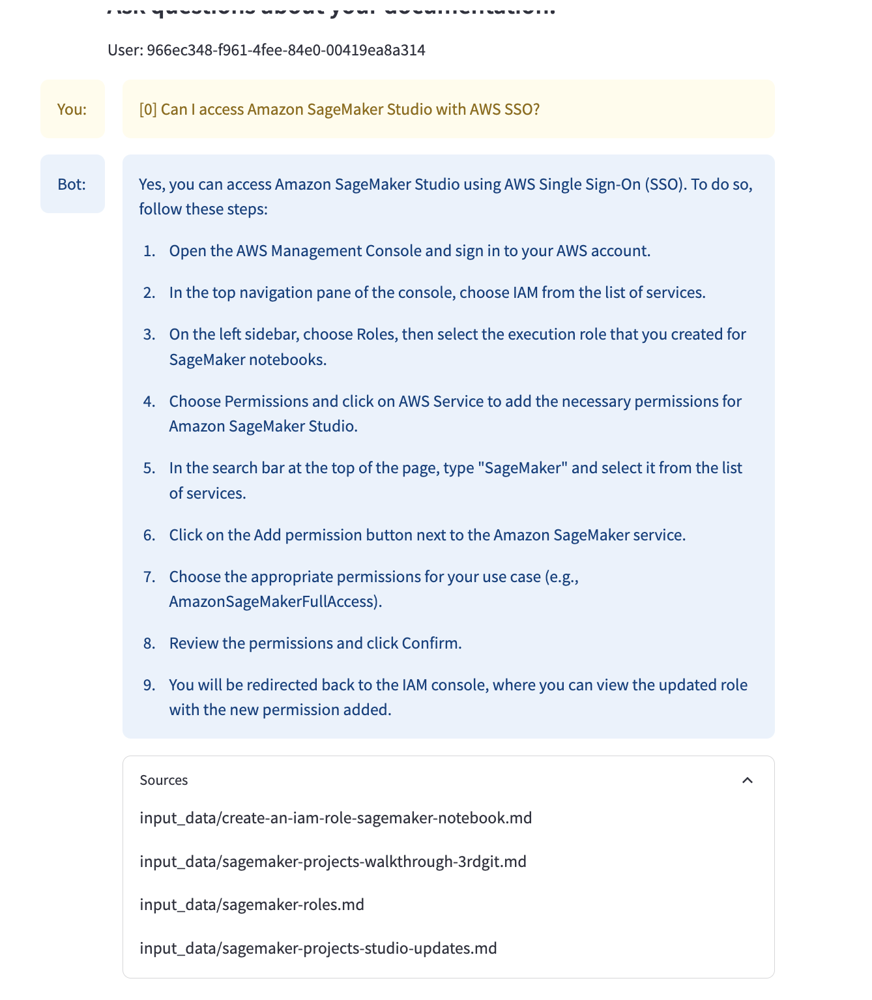

# Repository name: llm-qa-2023


This repository contains POC solution to the problem of knowledge retrieval from documentantion.


### Introduction
First of all, I want to underline that as in the task description, the following is only a POC and is used only to demonstrate the feasability of the solution. Based on POC solution it's possible to make more informative decissions for further development.

Mainly, such POC is useful for:
- Answering if this solution is feasible.
- Estimating the effort of production deployment.
- Designing final solution.
- Experimenting with new frameworks.
- Drawing a roadmap of deployment: what is the MVP, what are the project stages, ...
- Determining future bottlenecks, i.e.: which components are slowest, where will be the highest traffic, what will be the main cost of the solution, which functionalities are easy / hard to implement, ...
- Showing customer a first draft of the solution to get initial comments and feedback

### Deliverable
- Github repository with cloud formation template to create infrastructure and code to deploy the app locally.
- Conversation bot is able to embedd documents and user queries and find most relevant documents to the query.
- Bot is extracting the knowledge from the documents and based on this context, bot is formulating the answer as well as returns relative documents.
- Bot has the "memory", so context of the conversation is not lost. It allows for asking subsequent questions.

Here are two short video samples showing the solution (they are fast-forwarded). Inference on the local machine is really slow (around 90 seconds).

https://github.com/Sypek/llm-qa-2023/assets/44975100/3c60df18-f16e-46cb-ba2c-9774d1cc1e21

https://github.com/Sypek/llm-qa-2023/assets/44975100/23b5638d-43d1-48a0-b47f-7f557c0dbac4

And couple of screenshots:





### Design

As stated in the task description, I focused on using AWS components as much as I could. Also as mentioned before, I focused only on implementing some of the components to simplify the solution. My decission was motivated by the following factors:
- POC should provide sufficient functionality to demonstrate the faesability of the solution, it doesn't need to be a perfect, ready to go solution
- I wanted to reduce costs of cloud services
- Personal factor: time constraints

In the next sections I will also add comments of possible extensions and things to keep in mind when deploying model and describe simplifications of this solution.

#### Solution architecture (POC)
I've decided to go with pretty straightforward approach of Q&A levering AWS, ML and LLMs.

I've decided to implement RAG solution, which is data retrieval method. It's designed for levereging power of modern LLMs with private data and can be easily described in a couple of steps:
- Embedding documents - getting numerical representation of text data
- Similiarity search - based on query, looking for most similar documents to the query
- Answer generation - documents are added as a context to the query and generative model return the answer.

RAG is also a good first approach as it does not require model fine-tuning. With huge models, fine-tuning is not easy, takes a lot of time and is expensive. Although there are methods like LORA of PEFT to mitigate the complications of fine-tuning by simplifying it or making some tricks to make this process easier. Fine-tuning is not mandatory, although it should improve the quality of the solution, especially for domain specific vocabulary and tasks. In this task, fine-tuning could lead to better representation of hte documents for unseen words and concepts. In our scenario, there are a lot of domain specific words around Sagemaker and in general, docs are quite similar (as comparing to any other documents we can think of). The main consequence is, that embeddings of those texts will be very similar (documentes are close to each other in multi dimensional space) which makes retrieval a harder task.

Infrastrucure on AWS account was created using CloudFormation.

Infrastructure components:
- GUI (chat interface): Streamlit app
- Model serving: 
    - SageMaker Endpoint (embeddings)
    - Local (generative)
- Storage: S3 bucket
- LLM framework: Langchain
- Vector database: Chroma

Diagram of the solution can be seen below:


#### Architecture and frameworks: decision justification
- Vector Database: ChromaDb
    - ChromaDB is popular vector database, often proposed as a default solution in LLM systems. It's sufficient for this POC solution, can be cached and used locally. Supports cosine similarity metrics. Supports filtering based on metadata, which is important from the legal point of view. While querying database, we can filter which documents should / shouldn't be returned, which was one of the requirements of the solution.
        - For simplicity, I loaded data to Chroma in Sagemaker notebook and then saved the db files to S3 bucket. Then, db files was downloaded locally, so I could start local ChromaDb.
- GUI: Streamlit app
    - I was familiar with createing simple GUIs with streamlit so I've decided to go with this framework, it's well-known and commonly used for such tasks.
- Storage:
    - S3 is probably almost all the time go-to solution while working with AWS, unless certain specific requirements are required.
- LLM framework: Langchain
    - Probably most popular LLM framework as of date. Can be used as simple wrapper around many models and allows to create dialog scenarios.
- Processing / computing layer: Sagemaker
    - For ease of use, I leveraged Sagemaker notebooks to perform such operations as deploying endpoints, data preprocessing or loading data to db.
- Model serving:
    - Models were initially hosted as Sagemaker Endpoints but due to quotas on my test account, I was only able to host a single endpoint, which was used to trigger calculation of embeddigns.
    - The other model (generative one) was hosted by me locally using GPT4All.

Note: I was experimenting with AWS Kendra for documentation retrieval system, which could replace both embeddigs and vector database component, but due to some limitations of Kendra, solution was not working properly.

Other questions from the task that are not implemented by I want to share my ideas how I would approach it:
- Allows users to use only some documents:
    - If we know the users of our app, those are registered users for exmaple, we can "attach" region to each user and use filtering at the level of database retrieval to limit results only to the ones that are matching the region. How? Add metadata to each document. This should be easy task.
    - Deploying whole solution in different regions and adding users to different regions. Each s3 bucket in different region will store only applicable documents.
    - Or create different buckets for certain documents and add rules (based i.e. on geolocation of API calls) and limit access only to some resources.
    
- Updating the documnets:
    - That's mostly at the level of storage layer (s3) and data ingestion layer to vector db. Depending on the scenario, we can embedd new version of document and delete the previous one as soon as new document will be added to s3. Or we can do batch transorm update (once a day, one a week, ...).

#### Models
I've used two separate models for this task.
- One model is designed to compute embeddings. This model is a sentence transformer `huggingface-textembedding-all-MiniLM-L6-v2`
- The second model is a generative, text2text model, the one used by me locally is `llama-2-7b-chat`.

#### Data processing and conversation chain
Langchain framework was used for converstion between human and bot.

First documents are read using markdown reader. Then, documents are chunked into the smaller parts, embedded and saved in vector db.

For the conversation purpose, I used `ConversationalRetrievalChain` which allows for conversation with retrieval. Context of the conversation is preserved in the memery which allows to further question having in mind previous parts of discussion. Moreover, the solution returns relevant documents. 

Note: As sample questions are rather specific to a single document, in my approach documents are stuffed and combinded. This approach is sufficient for questions were answer in not spreaded among many documents. If that was the case, some other approach should be used, for example some form of map-reduce.

What is important in chunking and documents retrieval: Transformer models are working with tokens and each model has a maximum capability of handling X tokens. So while providing documents to the transformer, the documents cannot be too long and we cannot use too many documents as well.


#### How to improve solution for POC
- Host Streamlit on AWS (for example on EC2 instance)
- Vector database:
    - Host Chroma on AWS (EC2 instance)
    - Use AWS OpenSearch which is AWS version of vector database
- Use Sagemaker Endpoint for Generative LLM instead of locally hosting it


#### How to improve the solution to be closer to production deployment
Before going into production, there are numeroues questions that need answers in order to implement the solution properly.

In this scenario, my advice would be to move everything as much as possible to AWS managed services (and if possible, as much serverless as possible).

Description:
- Application is serverless.
- Authentication is provided by Cognito.
- Static parts of the application are delivered thorugh CloudFront, which is a content delivery system. Not only it provide fast access to static files, it provides caching and gives another layer of security and protection.
- Communication with services goes through custom API behind API Gateway.
- Lambda functions are used to talk with different services: Sagemaker Endpoints and OpenSearch.
- Context of the conversation can be either passed through Lambda (as a parameter, if text is not too long) or can be saved in DynamoDb.
- OpenSearch is used as a vectordatabase.
- Sagemaker endpoints are either serverless (if we allows for slower answers) or real-time, but this time Sagemaker autoscaling is required to handle ups and downs in traffic.
- Finally, documents and data is stored on s3 bucket.
- Data is loaded from s3 to OpenSearch:
    - either as a scheduled event by using EventBridge
    - after adding files to S3
    - data is loaded using SageMaker Processing job or AWS Glue
- All logs for monitoring are stored in CloudWatch


**What is important in this solution, is that everything is managed by AWS and almost every component is serverless.**


#### Last part: model evaluation
This is still ongoing research on how to evaluate LLM systems but here are some of my ideas.

- Budget
    - Depending on the budget, we need to adjust instance types and required latency which will have an impact on the model. Probably, the smaller the model the worse results we can obtain.
- Experts
    - For domain knowledge, experts knowledge can be very valuable to manually determine which answers are correct.
- Eyeballing
    - Not quantitive and reproducible method, but can give some insights if solution is at least working.
- LLM to generate QA
    - I provided just a mini example in `notebooks/eval.ipynb` how we can use prompt engineering to generate questions and aswers using LLM for a ceratin doc. Assuming this answer is correct, we can compare results of our solution and answer.
- User Feedback
    - Especially important in production phase. User's can report certain cases where model in not working properly.
- Quantitive metrics:
    - We have a dataset with ground truth:
        - We can apply common NLP metrics like: BLEU, METEOR, ROUGE althugh they are based on exact matches, which may be not so applicable
        - BERT score is based on capturing semantics with embeddins and does not require exact matches
    - 

### Steps to run the app
1. Use CloudFormation to set up the infrastructure. Main resources that are created: S3 bucket, Sagemaker Notebook Instance, roles.
```
sh infrastructure/create_stack.sh
```````

2. Run python script to upload local data with documentation to S3 bucket.
```
python upload_data_to_s3.py
```

3. Open Sagemaker studio and run those two notebooks, first deploys Sagemaker endpoints, second loads documents from s3, chunks them, embedds each chunk, loads into vector database and finally saves db on s3.
```
notebooks/deploy_endpoints.ipynb
notebooks/create_embeddings.ipynb
```

4. Run the app (locally)
```
cd app 
streamlit run streamlit_app.py
```
